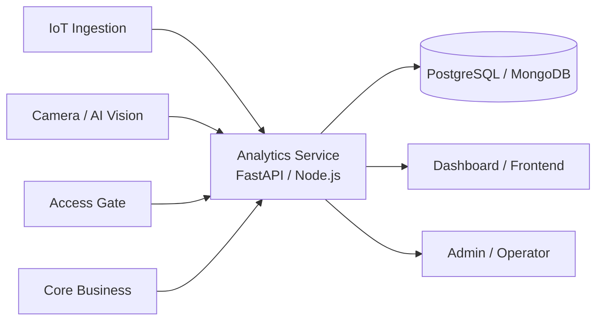
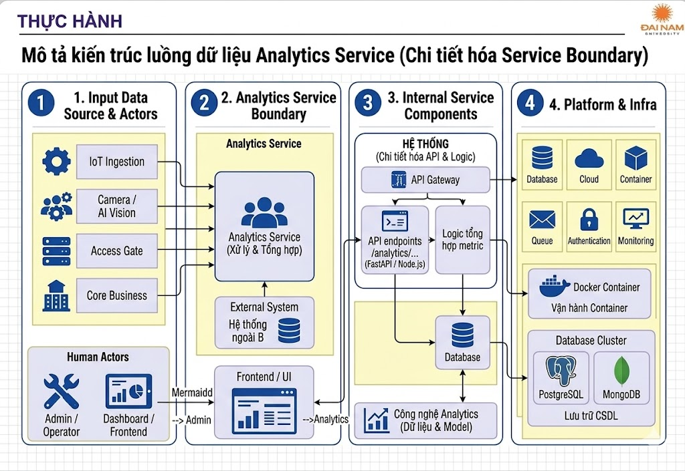

# Service Boundary của nhóm

## 1. Thông tin nhóm

- Tên nhóm: Nhóm 13
- Lớp: CNTT 17-09
- Thành viên: Lê Thị Bình, Lương Thị Thu Hương, Nguyễn Thị Thanh
- Service nhóm phụ trách: Analytics
- Sản phẩm tổng thể của lớp:B5-Xây dựng dịch vụ tổng hợp và phân tích dữ liệu.

## 2. Actor

Ai tương tác với hệ thống/service?
Dashboard/Frontend — gọi API để hiển thị báo cáo, biểu đồ
Admin/Operator — xem thống kê, báo cáo hệ thống
Các service khác — IoT Ingestion, Camera/AI Vision, Access Gate, Core Business (cung cấp dữ liệu)

## 3. System Boundary

Nhóm em xây phần nào?
-  Analytics Service 

Phần nhóm kiểm soát:
- FastAPI/Node.js app — viết code các endpoint /analytics/...
- Logic tổng hợp — code tính toán metric (đếm lượt, tính trung bình nhiệt độ, đếm cảnh báo,...)
- Database — setup PostgreSQL/MongoDB để lưu dữ liệu đã tổng hợp
- Docker container — đóng gói service chạy được

Phần nhóm chỉ tích hợp:
- IoT Ingestion Service
- Camera Stream / AI Vision Service
- Access Gate Service
- Core Business Service

## 4. Service Boundary

Service của nhóm có trách nhiệm gì?
- Thu thập dữ liệu từ các service khác
- Tổng hợp và tính toán metric
- Trả về báo cáo JSON theo yêu cầu
- Cung cấp endpoint cho dashboard

Service KHÔNG làm gì?
- Không xử lý trực tiếp dữ liệu cảm biến thô
- Không điều khiển thiết bị IoT
- Không xử lý nhận diện khuôn mặt/hình ảnh
- Không ra quyết định kiểm soát truy cập

## 5. Input / Output

### Input

- Dữ liệu cảm biến từ IoT Ingestion (nhiệt độ, chuyển động)
- Dữ liệu phát hiện từ Camera/AI Vision
- Dữ liệu ra/vào từ Access Gate
- Dữ liệu cảnh báo từ Core Business

### Output

{
  "date": "2026-05-02",
  "total_access": 120,
  "total_alerts": 5,
  "avg_temperature": 30.8,
  "motion_detections": 45,
  "abnormal_events": 3
}

## 6. API dự kiến

| Method | Endpoint               | Mục đích |
|--------|------------------------|----------|
| GET    | /health                | Kiểm tra service |
| GET    |/analytics/summary      |Báo cáo tổng hợp theo ngày |
| GET    |/analytics/access       |Thống kê lượt ra/vào theo giờ |
| GET    |/analytics/temperature  |Nhiệt độ trung bình theo phòng/khu vực |
| GET    |/analytics/alerts       |Số cảnh báo trong ngày |
| GET    |/analytics/motion       |Số lần phát hiện chuyển động |

## 7. Phụ thuộc service khác

Service này gọi đến service nào?
- IoT Ingestion — lấy dữ liệu cảm biến
- Camera Stream / AI Vision — lấy dữ liệu phát hiện
- Access Gate — lấy dữ liệu ra/vào
- Core Business — lấy dữ liệu cảnh báo/quyết định

Service nào gọi đến service này?
- Dashboard/Frontend — lấy báo cáo để hiển thị

## 8. Sơ đồ minh họa

 - Hình thực hành phần 1

## Phần thực hành 2
- Ai là consumer?
Nhóm 13 (Analytics) là consumer của 4 nhóm sau — tức là nhóm mình gọi API đến để lấy dữ liệu:
+ Nhóm làm IoT Ingestion → lấy nhiệt độ, chuyển động
+ Nhóm làm Camera / AI Vision → lấy dữ liệu phát hiện
+ Nhóm làm Access Gate → lấy lượt ra/vào
+ Nhóm làm Core Business → lấy cảnh báo, quyết định

- Ai là provider?
Nhóm 13 là provider cho:
+ Nhóm làm Dashboard/Frontend → họ gọi API /analytics/... của mình để hiển thị báo cáo

- Điểm giao tiếp cần chốt với các nhóm:
| Nhóm               |Cần chốt|
|--------------------|-------------------------------------------------|
| IoT Ingestion      | Endpoint lấy dữ liệu cảm biến, format JSON trả về|
| Camera / AI Vision | Endpoint lấy kết quả phát hiện, tần suất cập nhật|
| Access Gate        | Endpoint lấy log ra/vào, lọc theo thời gian|
| Core Business      | Endpoint lấy danh sách cảnh báo|
| Dashboard/Frontend | Format JSON output của /analytics/summary, tần suất gọi|
